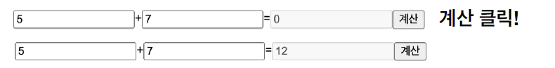
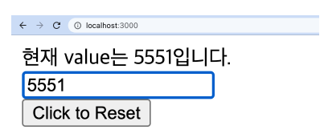

# React 실시간 강의 quiz 모음

quiz 1-1 (JSX 렌더시 무시되는 값)

```
다음 코드를 render하는 경우 어떤 결과가 나오는지 확인
```

```js
const App = () => {
  return (
    <>
      <div>{[false, null, undefined, true]}</div>
      <div>{false}</div>
      <div>{null}</div>
      <div>{undefined}</div>
      <div>{true}</div>
    </>
  );
};
```

quiz 1-2

```
1부터 100까지 들어있는 array가 있을 때,
7의 배수인 경우 '7의 배수'라는 텍스트를 포함한 button 출력.
10의 배수인 경우 출력하지 않음
그 외엔 숫자가 들어있는 button 출력
```

```js
import React from 'react';
// 1부터 100까지 들어있는 arr
const arr = Array.from(Array(100), (_, i) => i + 1);
const App = () => {
  return <div>{/* fill here */}</div>;
};
export default App;
```

quiz 2-1

```
1~100 이 들어있는 button 100개를 만들고
버튼을 클릭하면 들어있는 숫자를 alert로 띄워주기
ex) 화면상의 34가 써져있는 button을 클릭한 경우,
34를 alert로 띄워줌
```

```js
import React from 'react';
// 1부터 100까지 들어있는 arr
const arr = Array.from(Array(100), (_, i) => i + 1);
const App = () => {
  return <div>{/* fill here */}</div>;
};
export default App;
```

quiz 2-2

```
간단한 덧셈 계산기 만들기
코드를 어떻게 바꿔야 아래처럼 동작할까?
```



```js
import React from 'react';
const App = () => {
  const [result, setResult] = React.useState(0);
  return (
    <>
      <input type="number" />
      +
      <input type="number" />
      =
      <input type="number" disabled value={result} />
      <button type="button">계산</button>
    </>
  );
};
export default App;
```

quiz 2-3

```
useRef를 사용하여, Click to Reset 버튼을 클릭하면
input의 value를 초기화하도록 만들어보기
```

```js
const App = () => {
  const input = React.useRef(null);
  const handleClick = () => {
    if (input.current) {
    }
  };
  return (
    <div>
      <input type="text" ref={input} />
      <button type="button" onClick={handleClick}>
        Click to Reset
      </button>
    </div>
  );
};
```

quiz 2-4

```
현재 value는 ~~~ 입니다 문구도 추가해보기
```



```js
const App = () => {
  const input = React.useRef(null);
  const handleClick = () => {
    if (input.current) {
      input.current.value = '';
    }
  };
  return (
    <div>
      <input type="text" ref={input} />
      <button type="button" onClick={handleClick}>
        Click to Reset
      </button>
    </div>
  );
};
```

quiz 3-1

```
reset 버튼을 누르면 input에 focus가 되도록 해보기
```

```js
const App = () => {
  const [value, setValue] = React.useState('');
  const handleClick = () => {
    setValue('');
  };
  return (
    <div>
      <input
        type="text"
        value={value}
        onChange={(e) => setValue(e.target.value)}
      />
      <button type="button" onClick={handleClick}>
        Click to Reset and Focus!
      </button>
    </div>
  );
};
```

quiz 3-2

```
controlled input
유효성 검사 구현하기

요구사항
• id는 6글자 이상 20글자 이하인 경우 유효
• password는 12글자 이상 20글자 이하인 경우 유효
• 유효하지 않는 input 밑에 "유효하지 않은 ~~입니다." 출력
• id와 password가 둘 다 비어있으면 회원가입 버튼 disable 처리
• 유효하지 않은 input이 존재하는 경우 회원가입 버튼 클릭 시
  에러 alert를 띄워주고, 해당 input reset후, focus 시켜주기
• 모두 유효한 경우 회원가입 버튼 클릭 시 "회원가입 성공!"
  alert 띄워주기
```

```js
const App = () => {
  const handleClick = () => {
    alert('회원가입 성공!');
  };
  return (
    <div>
      <div>
        <input type="text" name="id" placeholder="6글자 이상 20글자 이하" />
        {/* 에러메세지 자리 */}
      </div>
      <div>
        <input
          type="text"
          name="password"
          placeholder="12글자 이상 20글자 이하"
        />
        {/* 에러메세지 자리 */}
      </div>
      <button type="button" onClick={handleClick} disabled={false}>
        회원가입
      </button>
    </div>
  );
};
```

quiz 3-3

```
email input을 추가하고, "숫자혹은문자@숫자혹은문자.숫자혹은문자" 포맷을 만족하는 경우 유효로 판단하기
(regex 사용해보기)

input이 무한정 늘어날 수 있도록
loop를 활용해 확장성 있는 코드 만들어보기
```

```js
const App = () => {
  const handleClick = () => {
    alert('회원가입 성공!');
  };
  return (
    <div>
      <div>
        <input type="text" name="id" placeholder="6글자 이상 20글자 이하" />
        {/* 에러메세지 자리 */}
      </div>
      <div>
        <input
          type="text"
          name="password"
          placeholder="12글자 이상 20글자 이하"
        />
        {/* 에러메세지 자리 */}
      </div>
      <button type="button" onClick={handleClick} disabled={false}>
        회원가입
      </button>
    </div>
  );
};
```

quiz 4-1

```
document를 클릭하면 input의 value를 console에 출력하도록 작성하기
```

```js
import React, { useEffect } from 'react';
const App = () => {
  const [value, setValue] = React.useState('');
  return (
    <input
      type="number"
      onChange={(e) => {
        setValue(e.target.value);
      }}
    />
  );
};
export default App;
```

quiz 4-2

```
document를 클릭하면 input의 value를 화면에 출력하도록 작성
하기
```

```js
import React, { useEffect } from 'react';
const App = () => {
  const [value, setValue] = React.useState('');
  return (
    <div>
      <input
        type="number"
        onChange={(e) => {
          setValue(e.target.value);
        }}
      />
      {/* 값은 ~~입니다 */}
    </div>
  );
};
export default App;
```

quiz 4-3

```
input value를 수정하면 3초 이후에 현재 value를 console.log
를 통해 1회 출력하는 컴포넌트 만들기
```

```js
import React, { useEffect } from 'react';
const App = () => {
  const [value, setValue] = React.useState('');
  return (
    <input
      type="number"
      onChange={(e) => {
        setValue(e.target.value);
      }}
    />
  );
};
export default App;
```

quiz 4-4

```
실습 1-0 의 요구조건을 만족한채로,
3초 경과하기 이전 value를 수정하면 다시 3초 대기
useEffect, dependency array, cleanup 활용하기
```

```js
import React, { useEffect } from 'react';
const App = () => {
  const [value, setValue] = React.useState('');
  return (
    <input
      type="number"
      onChange={(e) => {
        setValue(e.target.value);
      }}
    />
  );
};
export default App;
```

quiz 4-5

```
실습 1-1 의 요구조건을 만족한채로,
남은 시간(단위: 초) 을 화면에 표시해주기
```

```js
import React, { useEffect } from 'react';
const App = () => {
  const [value, setValue] = React.useState('');
  return (
    <div>
      <input
        type="number"
        onChange={(e) => {
          setValue(e.target.value);
        }}
      />
      {/* 남은시간 ?초 */}
    </div>
  );
};
```

quiz 4-6

```
실습 1-2 의 요구조건을 만족한채로,
console.log대신 화면에 input의 값을 출력하기
```

```js
import React, { useEffect } from 'react';
const App = () => {
  const [value, setValue] = React.useState('');
  return (
    <div>
      <input
        type="number"
        onChange={(e) => {
          setValue(e.target.value);
        }}
      />
      {/* 남은시간 ?초 */}
      {/* 값은 ~~입니다 */}
    </div>
  );
};
```

quiz 5-1

```
지난번 실습 때 만든 회원가입 form 컴포넌트에서
회원가입 성공시 alert를 띄우는 대신
안녕하세요 {id}님! 이 적힌 페이지로 이동시키기
```

quiz 5-2

```
1. 방금 전 실습에서 로그인 완료 화면에 input과 button 추가
2. input입력하고 button 클릭하면 해당 내용으로 게시글 생성
3. 게시글 클릭 시 해당 게시글 detail 페이지(/post/:id로 이동)
4. detail 페이지에서 뒤로가기 클릭 다시 글쓰기 페이지로 이동
(기존 게시글들 남아있어야함)
```

---

##### 진상현 강사님 자료에서 발췌했습니다.
